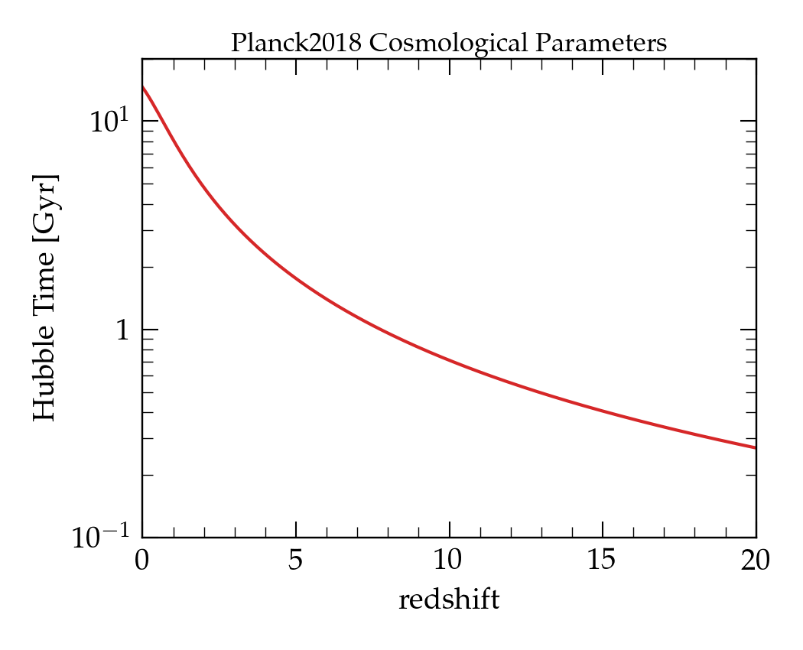

# Cosmology framework

`Cosmology` is the class containing all the functions used by **SimProp** to describe the Universe evolution.

We assume a [Lambda-CDM](https://en.wikipedia.org/wiki/Lambda-CDM_model) model in the approximation of negligible radiation components, thereby:

* The Hubble parameter at redshift $z$ is computed as $H(z) = H_0 \sqrt{(1+z)^3 \Omega_m + \Omega_\Lambda}$

* The element $dt/dz$ is given by $\frac{dt}{dz} = \frac{1}{H(z)(1+z)}$

* The Hubble time is defined as $t_H = H(z)^{-1}$

The input cosmological parameters are:

| Parameter        | Description                  |  
| :--------------- | :--------------------------- |  
| $h$              | Reduced Hubble constant      |  
| $\Omega_b h^2$   | Physical baryon density      | 
| $\Omega_c h^2$   | Physical dark matter density |  
| $\Omega_\Lambda$ | Dark energy density          |  

An updated parameter list can be obtained by using the derived class `Planck2018` based on the 2018 release of Cosmological Parameters by the PLANCK coolaboration[^Planck2018]:

| Parameter        | Description                  | Value  |
| :--------------- | :--------------------------- | :------| 
| $h$              | Reduced Hubble constant      |   0.674| , , 0.685 
| $\Omega_b h^2$   | Physical baryon density      | 0.02237|
| $\Omega_c h^2$   | Physical dark matter density |  0.1200| 
| $\Omega_\Lambda$ | Dark energy density          |   0.685|

[^Planck2018]: Planck Collaboration, 2020, A\&A, 641, A6 [[ADS](https://ui.adsabs.harvard.edu/abs/2020A%26A...641A...6P)]

An example of usage of the `Planck2018` Cosmology class can be found:

<figure markdown> 
  { width="500" }
  <figcaption>Image caption</figcaption>
</figure>
